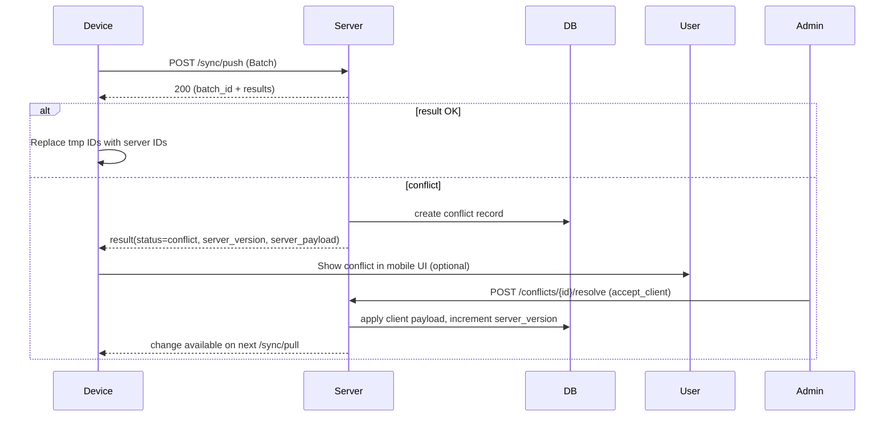

# Sync Lifecycle & Examples

This document describes the expected sync push/pull lifecycle between mobile devices and the MIS server, example payloads for typical flows, how conflicts are detected and surfaced, and resolution options.

## Overview

Primary endpoints:
- POST /api/v1/mobile/sync/push — device -> server (batch of local changes)
- POST /api/v1/mobile/sync/pull — device <- server (server changes since token)
- POST /api/v1/mobile/sync/ack — device acknowledges server-delivered changes

Key concepts:
- client_temp_id: local client-generated temporary id for newly-created resources before server assigns canonical ids
- client_version: a per-resource incrementing integer the client maintains for optimistic ordering
- server_version: server-side versioning (integer or timestamp) returned to the client
- sync tokens: opaque tokens used to request deltas from server (delta pagination)

---

## Typical Push Flow

1. App appends local operations to a local change log and assigns `client_temp_id` for new resources.
2. App submits a `SyncBatch` to `/sync/push` (batched items). The batch includes a `client_sync_token` representing the client's last known server token.
3. Server validates, persists a `sync_batch`, and processes items sequentially (or in a worker) applying domain logic.
4. For each item, server returns a per-item result with `status` = `ok` | `conflict` | `error` and a `server_id` for created/updated resources.
5. Server returns a `batch_id` and updated `server_sync_token` for subsequent pulls.

### Example request

POST /api/v1/mobile/sync/push

```json
{
  "device_id": "device-uuid-123",
  "client_sync_token": "tok_20251203_123",
  "items": [
    {
      "client_temp_id": "tmp-1",
      "resource_type": "submission",
      "action": "create",
      "payload": { "form_id": "f-1", "form_version": "v2", "data": { "fieldA": "ok" } },
      "client_version": 1
    },
    {
      "resource_type": "meter",
      "action": "update",
      "payload": { "id": "m-123", "reading": 42 },
      "client_version": 5
    }
  ]
}
```

### Example response

```json
{
  "batch_id": "batch-uuid-789",
  "processed_at": "2025-12-22T12:34:56Z",
  "results": [
    {
      "client_temp_id": "tmp-1",
      "status": "ok",
      "server_id": "sub-987"
    },
    {
      "client_temp_id": null,
      "status": "conflict",
      "server_id": "m-123",
      "error": "Version mismatch: server_version=7, client_version=5"
    }
  ]
}
```

When an item returns `conflict`, the device may request the conflict detail or wait for a server-synchronized conflict entry to show in the admin UI.

---

## Pull Flow

- Device sends last known `since_token` to `/sync/pull` and receives a `changes` array and `next_token`.
- Device applies server changes locally and acknowledges with `/sync/ack`.

### Example request

POST /api/v1/mobile/sync/pull

```json
{ "since_token": "tok_20251203_123" }
```

### Example response

```json
{
  "next_token": "tok_20251203_124",
  "changes": [
    {
      "id": "sub-999",
      "resource_type": "submission",
      "action": "create",
      "payload": { "form_id": "f-1", "data": { "fieldA": "reviewed" }, "status": "approved" },
      "server_version": 3
    }
  ]
}
```

Device acknowledges the pull with `ack_token` in `/sync/ack` to allow server to garbage-collect or mark delivered batches.

---

## Conflict Detection Example

Server algorithm (simplified):
- For updates: compare `client_version` vs server `server_version` for that resource.
- If client_version < server_version and payload differs, flag conflict.
- For creates: if unique constraint conflict (e.g., duplicate code), respond with conflict/error.

Conflict record example stored in `conflicts` table:

```json
{
  "id": "conf-abc-1",
  "resource_type": "meter",
  "resource_id": "m-123",
  "server_payload": { "reading": 50, "last_updated_by": "sys" },
  "client_payload": { "reading": 42, "device_ts": "2025-12-22T11:00:00Z" },
  "detected_at": "2025-12-22T12:45:00Z"
}
```

Admin can resolve: Accept Server / Accept Client / Manual Merge. When resolved, a resolution action and audit log is stored.

---

## Conflict Resolution Example

POST /api/v1/mobile/conflicts/{id}/resolve

```json
{ "resolution": "accept_client" }
```

Server applies client's payload, increments server_version, stores resolution action and notifies device via next pull or a conflict-specific push notification.

---

## Media Upload Flow

1. Client requests a presign at `POST /api/v1/mobile/media/presign` with filename and content_type.
2. Server returns `upload_url` and `key` and a short TTL.
3. Client uploads directly to object store using `upload_url`.
4. Client includes `key` in `Submission` payload; server verifies upload and creates `submission_media` record.

---

## Mermaid Sequence Diagram (common push + conflict)



---

## Best Practices & Notes
- Keep batches size-limited (e.g., 50 items) and support chunked retry on partial failures.
- Make operations idempotent where possible (idempotency by client_temp_id and client_version).
- Return helpful per-item `error` messages for actionable feedback.
- Store raw JSON payloads in `sync_items` for audit and reprocessing.
- Consider adding a `replay` endpoint for batches to re-run processing under admin control.
